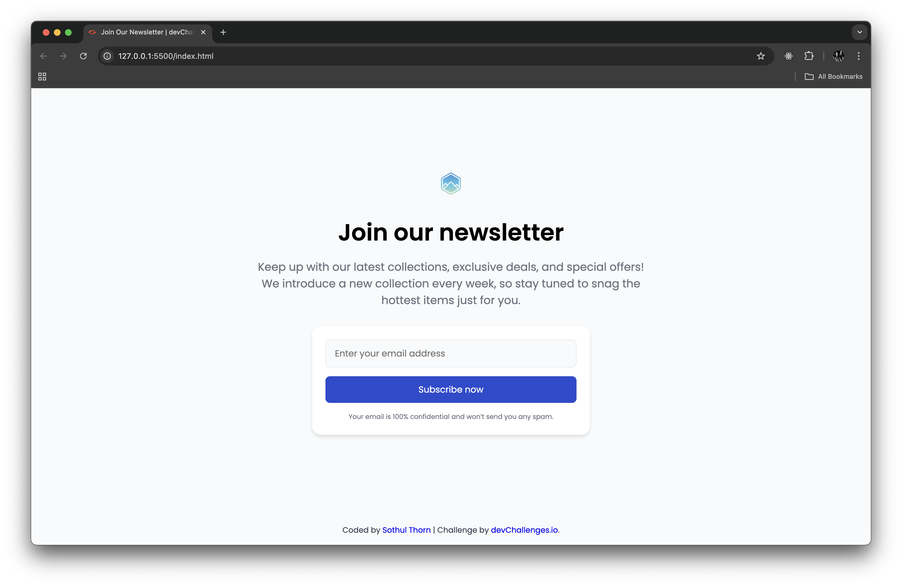

<!-- Please update value in the {}  -->

<h1 align="center">Join Our Newsletter | devChallenges</h1>

   Solution for a challenge <a href="https://devchallenges.io/challenge/join-our-newsletter" target="_blank">Join Our Newsletter</a> from <a href="http://devchallenges.io" target="_blank">devChallenges.io</a>.

  <h3>
    <a href="{https://your-demo-link.your-domain}">
      Demo
    </a>
     | 
    <a href="{https://your-url-to-the-solution}">
      Solution
    </a>
     | 
    <a href="https://devchallenges.io/challenge/join-our-newsletter">
      Challenge
    </a>
  </h3>

<!-- TABLE OF CONTENTS -->

## Table of Contents

- [Table of Contents](#table-of-contents)
- [Overview](#overview)
  - [What I learned](#what-i-learned)
  - [Useful resources](#useful-resources)
  - [Built with](#built-with)
- [Features](#features)
- [Acknowledgements](#acknowledgements)
- [Author](#author)

<!-- OVERVIEW -->

## Overview

This is a static HTML/CSS implementation of the DevChallenges "Join Our Newsletter" challenge. The goal is to recreate the provided design

### What I learned

- Practiced centering and layout with Flexbox and CSS Grid patterns.
- Scoped CSS selectors and learned to avoid unintended inheritance by using direct child selectors (`>`).

### Useful resources

- DevChallenges challenge: https://devchallenges.io/challenge/join-our-newsletter
- MDN: Flexbox guide — https://developer.mozilla.org/en-US/docs/Web/CSS/CSS_Flexible_Box_Layout/Basic_Concepts_of_Flexbox
- CSS-Tricks — centering in CSS: https://css-tricks.com/centering-css-complete-guide/

### Built with

- HTML5
- CSS (Flexbox)
- Google Fonts (Poppins)

## Features

- Pixel-accurate card layout and form controls.
- Responsive width with a centered hero and accessible form fields.

This application/site was created as a submission to a [DevChallenges](https://devchallenges.io/challenges-dashboard) challenge.

## Acknowledgements

- Thanks to [DevChallenges](https://devchallenges.io/challenges-dashboard) for the design brief and project idea.

## Author

- GitHub [@sothulthorn](https://github.com/sothulthorn)
